计算视频时间的脚本已经完成,可以用在不同的网站上来计算线上课程的时间

```python
from time import sleep
from selenium import webdriver
from selenium.webdriver import ActionChains
from selenium.webdriver.common.actions.wheel_input import ScrollOrigin
from selenium.webdriver.common.by import By

url = "https://www.bilibili.com/video/BV1fh411y7R8/?p=48&vd_source=6248bbe156e0f31bc6697c05cf70952c"

class Time:
    def __init__(self, hour=0, minute=0, second=0):
        self.hour = hour
        self.minute = minute
        self.second = second

    def __str__(self):
        return '%.2d:%.2d:%.2d' % (self.hour, self.minute, self.second)

    def __add__(self, other):
        if isinstance(other, Time):  # 如果是时间格式
            return self.add_time(other)
        else:  # 如果是数字格式
            return self.increment(other)

    def __radd__(self, other):
        """右加方法"""
        return self.__add__(other)

    def add_time(self, other):
        seconds = self.time2int() + other.time2int()
        return int2time(seconds)

    def increment(self, seconds):
        seconds += self.time2int()
        return int2time(seconds)

    def time2int(time):
        minutes = time.hour * 60 + time.minute
        seconds = minutes * 60 + time.second
        return seconds


def int2time(seconds):
    time = Time()
    minutes, time.second = divmod(seconds, 60)
    time.hour, time.minute = divmod(minutes, 60)
    return time


# time = Time(2, 3, 5)
# duration = Time(8, 5, 6)
# print(time + duration)
# print(time + 1337)
# print(1337 + time)
#
# t1 = Time(22, 43)
# t2 = Time(20, 41)
# t3 = Time(23, 37)
# total = sum([t1, t2, t3])
# print(total)

def opendriver():
    driver = webdriver.Chrome()
    return driver


def main(start, end):
    driver = opendriver()
    # 寻找时间元素
    sleep(10)
    driver.get(url)
    the_ul = driver.find_element(By.XPATH, '/html/body/div[2]/div[2]/div[2]/div/div[7]/div[2]/ul')
    lis = the_ul.find_elements(By.TAG_NAME, 'li')

    time_list = []
    for index, value in enumerate(lis):
        xpath = '/html/body/div[2]/div[2]/div[2]/div/div[7]/div[2]/ul/li[{0}]/a/div/div[2]'.format(index + 1)
        txt = value.find_element(By.XPATH, xpath).text
        if txt == '':
            list_p = driver.find_element(By.CLASS_NAME, 'cur-list')
            ActionChains(driver) \
                .move_to_element(list_p) \
                .perform()
            scroll_origin = ScrollOrigin.from_element(list_p)
            ActionChains(driver) \
                .scroll_from_origin(scroll_origin, 0, 10000) \
                .perform()
        print("TXT{0}: ".format(index + 1), txt)

        if (index >= start + 1) and (index <= end + 1):
            time_list.append(txt)

    print('**************************************************************')
    for index3 in range(len(time_list)):
        print(time_list[index3])
    print('**************************************************************')

    time_tot = Time(0, 0, 0)
    for index2 in range(len(time_list)):
        minandsec = time_list[index2].split(":")
        v_m = int(minandsec[0])
        v_s = int(minandsec[1])
        time1 = Time(0, v_m, v_s)
        time_tot = time_tot + time1
    print("总时间是:{0}".format(time_tot))

    return 0


if __name__ == '__main__':
    # 计算第一集到
    main(1, 3)
    print('结束')

```


P7

检验环境变量配置成功的方法,java和javac键入cmd中

如果环境变量设置不正确就可能导致src用javac变异不通过	

P8

java是gosling在95年提出来的,java是一种咖啡豆的名字

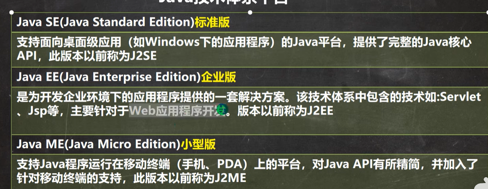

 P9

java重要特点

1,Java语言是面向对象的(oop)

2,Java语言是健壮的,java是强类型机制，异常处理，垃圾的自动收集等是java程序健壮性的重要保证

3,Java语言是跨平台的（之前javac产生的class文件是跨平台性的重点，.class文件可以在多个系统下面运行，这种特性成为跨平台性）

4,Java语言是解释型的

解释型语言：javascript，php，java，编译型语言：c/c++

区别是：解释性语言，编译后的代码，不能直接被机器执行，需要解释器来执行，编译性语言，编译后的代码，可以直接被机器执行，c/c++


P11

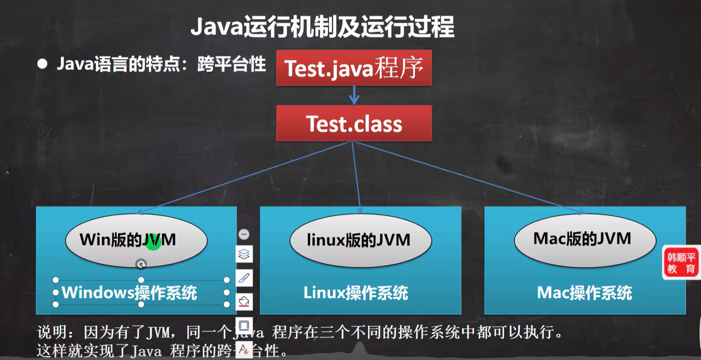

  JVM是包含在JDK中的，在不同的系统中是JVM帮我们做解释翻译的工作的

JAVA运行机制及运行过程

* Java核心机制- java虚拟机
  * JVM是一个虚拟的计算机，具有指令集并使用不同的存储区域，负责执行指令，管理数据，内存，寄存器，包含在JDK中
  * 会与不同的平台，有不同的虚拟机
  * JAVA虚拟机机制屏蔽了底层运行平台的差别，实现了“一次编译，到处运行”

JDK（java开发工具包） = JRE[]（JVM  + java核心类库（各种类）） + java开发工具（java，javac，javadoc，javap等）

如果是一个已经开发好的程序，我们只需要jre就可以运行java程序了


P13

为什么JDK里面有两个JRE，一个是公共jre，一个是jdk自带的jre，一些软件会用到公共jre


P14

配置环境变量

我们平时输入的cmd调出来的，其实叫做DOS命令行，其次环境变量需要配置JAVA_HOME，也需要配置%JAVA_HOME%\bin，开发工具都在bin目录下面


P17

需要查看DOS命令窗口

右击dos命令行上面选择属性,从属性中选择

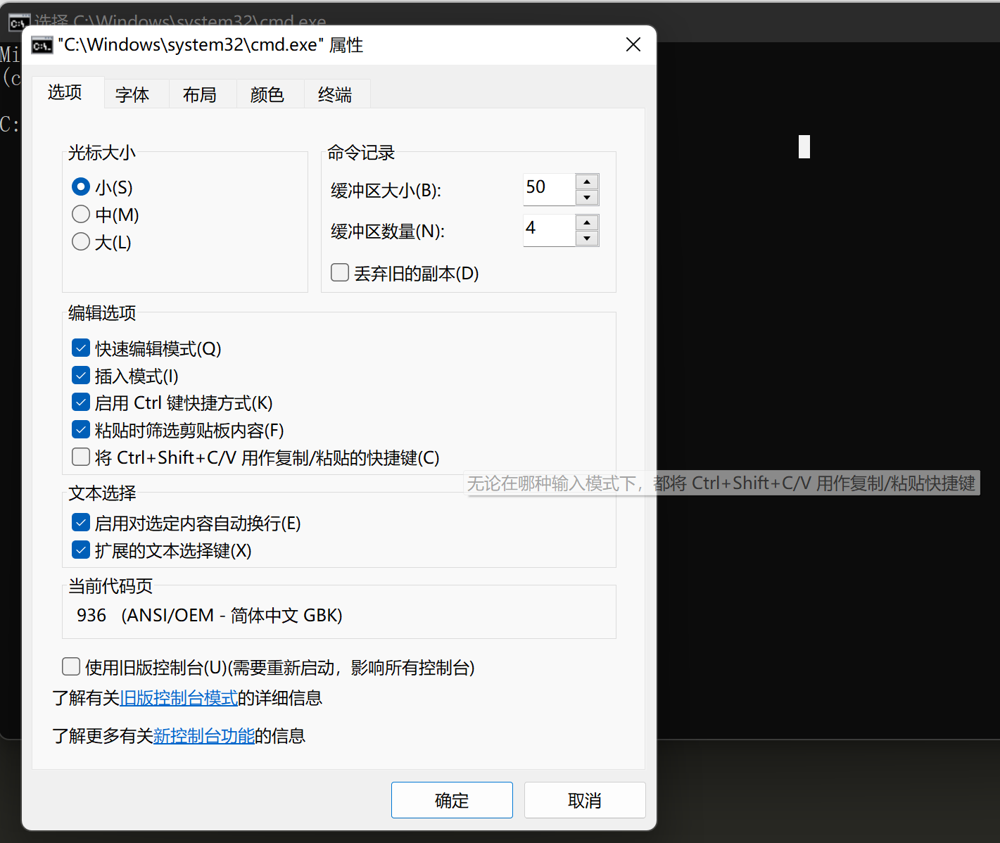

可以看到DOS编码使用的是GBK

```java
//这是java的快速入门,演示java的开发步骤
//对代码的相关说明
//1,public class Hello 表示Hello是一个类,是一个public公有的类
//2,Hello{}表示一个类的开始和结束
//3,public static void main(String[] args)表示一个主方法,即我们程序的入口
//4,main(){} 表示方法的开始和结束
//5,System.out.println("hello,world");表示输出"hello,world到屏幕"
//6,;表示语句结束

public class Hello{

	public static void main(String[] args){
			System.out.println("hello,world!");
	}
}
```

```shell
编译成字节码文件
javac Hello.java
需要带有java的后缀名 
java Hello
不需要带上.class的后缀,java命令后面跟着的是类名,如果写的是java.class,java会以为是运行java.class这个文件,导致找不到文件
```

作业:

```java
public class Hello{

	public static void main(String[] args){
			System.out.println("xx is studying java");
	}
}
作业路径:"C:\Users\MSI\Desktop\java_learning\javacode\Hello_z.class"
   "C:\Users\MSI\Desktop\java_learning\javacode\Hello_z.java"
```

P18

Java执行流程的分析

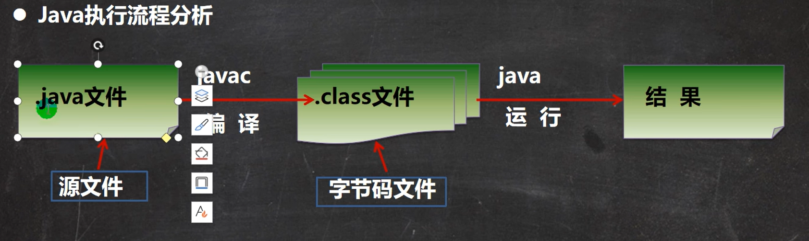

运行的本质就是将文件装载到java的虚拟机中执行

.class文件也成为字节码文件

* 编译注意点
  * .java文件是源文件,通过编译器将其编译成JVM可以识别的字节码文件
  * 在该源文件目录下,通过javac编译工具对Hello.java文件进行编译
  * 如果没有错误,没有任何提示,如果源码就有问题的话,javac是会报错的,如果没有问题会得到一个.class的字节码文件


* 通过运行工具java.exe对字节码文件进行执行

  注意:对.java文件重新修改之后,是需要javac重新编译的


P19

Java开发注意事项和细节说明

1,Java源文件以.java为扩展名,源文件的基本组成部分是类(class)

2,Java应用程序的执行入口是main()方法,它有固定的书写格式

```java
public static void main(String[] args){System.out.println("xx is studying java");}
```

3,Java语言严格区分大小写

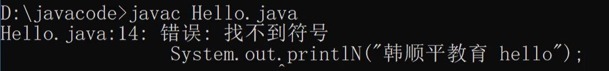

4,Java方法由一条条语句构成,每个语句以";"结束;

5,大括号都是成对出现的

==6,==一个源文件中最多只能有一个public类,其他类的个数不限

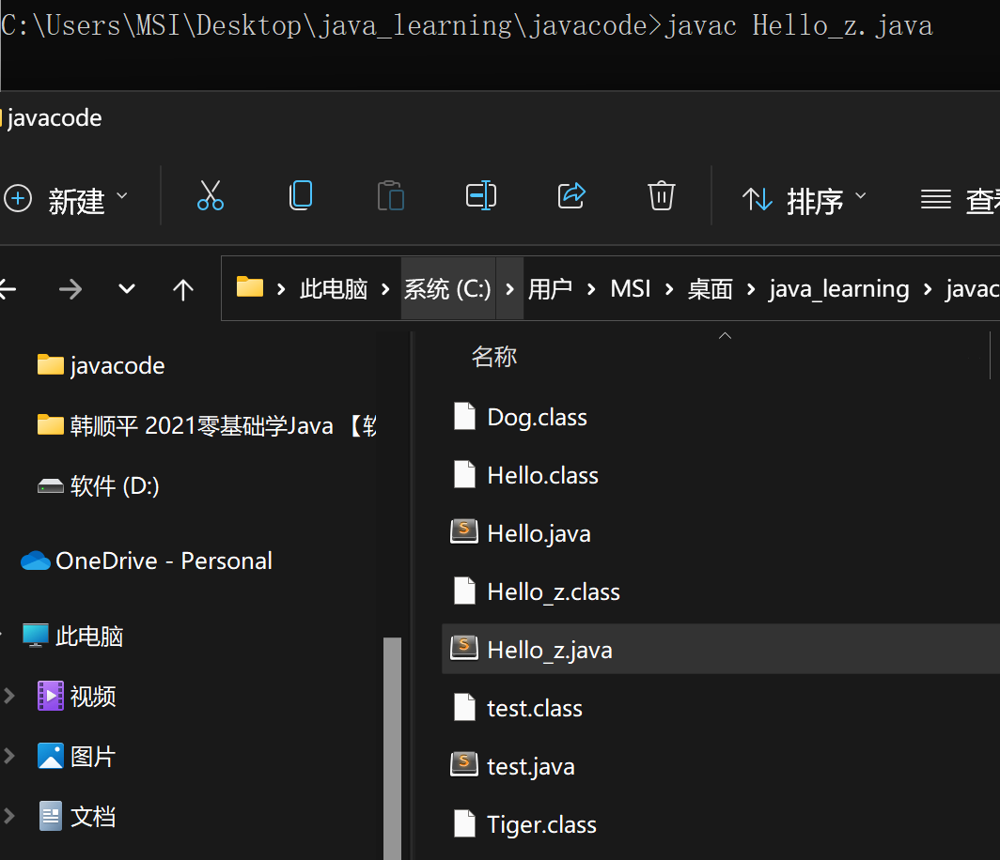

```java
public class Hello_z{

	public static void main(String[] args){
			System.out.println("敖宸闻 is learning java");
	}
}

//一个源文件中最多只能有一个public类,其他类的个数不限
class Dog{

}

class Tiger{
	
}
```


==7,==如果源文件包含一个public类,则文件名必须按该类名命名(源文件中带public的类名应该和文件名一致)

8,一个源文件中最多只能有一个public类,其他类的个数不限,也可以将main方法写在非public类中,然后指定运行非public类,这样入口方法就是非public的main方法

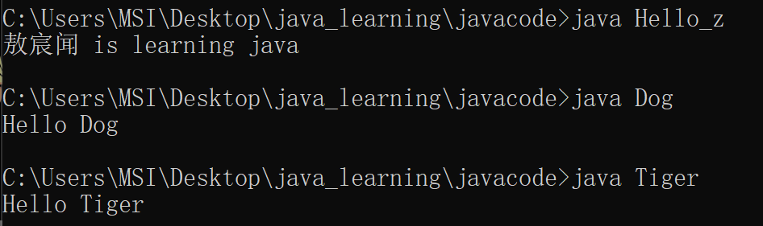

```java
public class Hello_z{

	public static void main(String[] args){
			System.out.println("敖宸闻 is learning java");
	}
}

//一个源文件中最多只能有一个public类,其他类的个数不限
class Dog{
	public static void main(String[] args){
			System.out.println("Hello Dog");
		}
}

class Tiger{
	public static void main(String[] args){
			System.out.println("Hello Tiger");
		}
}
```


P20

快速学习一个技术

* 了解自己学习新技术的需求是什么,看看能否使用传统技术解决

1,能解决但不完美

2,解决不了

* 所以我们需要学习新的技术和知识点

* 学习新技术或者知识点的基本语句和基本语法(不需要考虑细节)

* 在上面的基础上写一个快速入门(基础程序,CRUD)

开始研究技术的注意事项,使用细节,使用规范,如何优化

==>没有止境,技术魅力


P21

JAVA转义字符

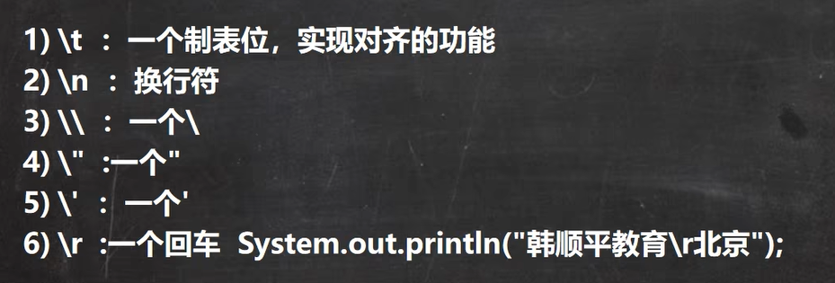

```java
public class ChangChar{
	public static void main(String[] args){
		// \t :制表符
		System.out.println("北京\t天津\t上海");
		
		//  \n :换行符
		System.out.println("jack\nsmith\nmary");
		
		//  \\ :一个\ 路径中的\必须需要转义才能表示出来
		System.out.println("C:\\Windows\\System32\\cmd.exe");
		
		//  \" :一个"  
		System.out.println("老韩说:\"要好好学习java,有前途\"");
		
		//  \' :一个'  
		System.out.println("老韩说:\'要好好学习java,有前途\'");
		
		//  \r :一个回车,回车的基本处理是将光标顶到语句的最前面
		//  输出敖宸闻学java后,光标移动到最前面,继续输入还可以,敖宸闻这三个字就会被替换
		System.out.println("敖宸闻学java\r还可以");
		// 如果要实现回车换行的结果 ,我们需要使用\r\n
		System.out.println("敖宸闻学java\r\n还可以");

	} 
}
```


P22

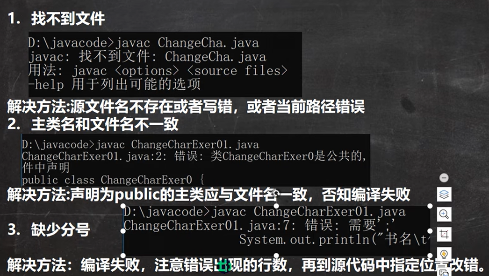

* 找不到符号,可能是关键字写错了
* 解析时已到达文件尾部(缺少大括号)

不好修改的错误,会遇到业务错误或者环境错误


P23

用于注解说明解释程序的文字就是注解,可以提高代码的阅读性,注释是一个程序员必须要具有的良好编程习惯

注释的类型:

1,单行注释

* 基本格式

格式://注释文字

2,多行注释

* 基本格式

格式:/\*注释文字\*/

3,文档注释

1)被注释的文字,不会被JVM(java虚拟机)解释执行

2)多行注释里面不允许有多行注释嵌套

```java
public class comment01{	
 	public static void main(String[] args){
 		
 		//单行注释
 		/*
 			多行注释
				*/
 		int n1 = 10;
 		int n2 = 30;
 		int sum = n1 + n2 ;
 		System.out.println("sum的结果:" + sum);
 	}
}
```

P24

* 文档注释:注释内容可以被JDK提供的工具javadoc所解析,生成一套以网页文件形式体现的该程序的说明文档,一般写在类前面

```java
/**
 * @author 敖宸闻
 * @version 1.0
 */
public class comment02{	
 	public static void main(String[] args){
 		
 		//单行注释
 		/*
 			多行注释
				*/
 		int n1 = 10;
 		int n2 = 30;
 		int sum = n1 + n2 ;
 		System.out.println("sum的结果:" + sum);
 	}
}
```

```shell
javadoc -d 文件夹名 -标注(@author) -标注(@version) 文件名
```


P25代码规范

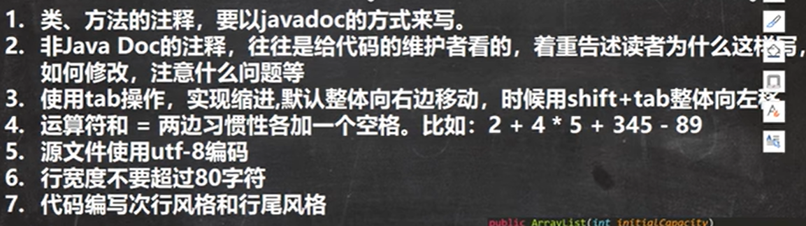

行尾风格

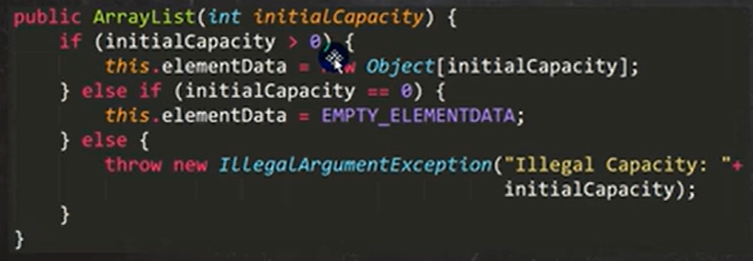

次行风格

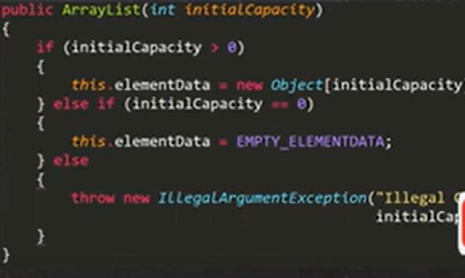


P26 DOS相关的命令

* DOS介绍

  DISK Operating System 磁盘操作系统,简单说一下windows的目录结构,

* 常用的dos命令

  * 查看当前的目录是有什么

  ​     dir dir d:\abc2\test200

  * 切换到其他盘下:盘符号cd

    切换到c盘  cd /D c:

  * 切换到当前盘的其他目录下(使用相对路径和绝对路径演示)

    cd d:\abc2\test200   cd ..\\..\\abc2\\test200

  * 切换到上一级:

    案例演示: cd ..

  * 切换到根目录: cd \\

    案例演示:cd \\

    ```dos
    // 新建一个文件目录(命令后面跟多个路径,可以创建多个文件)
    md 新建的文件目录
    // 移除目录(命令后面跟多个路径,可以删除多个文件)
    rd 需要移除的文件目录(可以跨盘符进行删除文件的操作)
    //直接到根目录下面
    cd \ 直接到根目录
    // 查看这个路径下的所有文件
    dir 路径 
    //查看指定的目录下所有的子级目录
    tree 路径
    //清屏
    cls
    //退出DOS
    exit
    //拷贝文件
    
    //删除文件
    
    //输入内容到文件(可以是新建的文件或者是老文件)
    echo hello > hello.txt
    
    //删除一个文件
    del hello.txt
    
    //输入一个空文件
    type null > null_file.txt
    
    //复制
    //将ok.txt文件复制到copy文件夹内
    copy ok.txt .\copy 
    -- copy 也可以改变名字
    copy ok.txt .\copy\cc.txt
    
    //剪切
    move ok.txt .\copy\ok2.txt
    move ok.txt .\copy\ok.txt
    ```

相对路径,绝对路径


# 第三章

### 第三章的大纲

* 变量的介绍
* +号的使用
* 数据类型
* 编码
* 数据类型转换


P35 变量的原理

* 变量是程序的基本组成单位
  * 无论是哪种高级程序语言编写的程序,变量都是其程序的基本组成单位,
    * 变量的三要素
      * 类型 
      * 名称
      * 值

* 变量的原理图

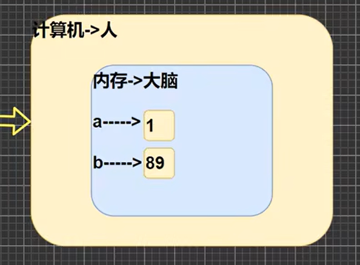


P36 变量的介绍

* 概念

  变量相当于内存中一个数据存储空间的表示,你可以把变量看做是一个房间的门牌号,通过门牌号我们可以找到房间,而通过变量名可以访问到变量(值)

* 变量使用的基本步骤

  1) 声明变量

     int a;

  2) 赋值

     a = 60;

  3) 使用System.out.println(a);

//我们也可以一步到位[int a = 60;通常我们是一步完成]

```java
public class Var01{	
 	public static void main(String[] args){
 	//声明变量
 	int a;
 	a = 100;
 	System.out.println(a);	
 	
 	int b = 800;
 	System.out.println(b);	
 	}
}
```

 

P37

用不同发的数据类型记录不同的数据

```java
public class Var02{	
 	public static void main(String[] args){
 	
 	int age = 30;
 	double score = 88.9;
 	char gender = '男';
 	String name = "King";

 	System.out.println("人的信息如下:");
 	System.out.println(name);
 	System.out.println(age);
 	System.out.println(score);
 	System.out.println(gender);
 	}
}
```


P38 变量使用的注意事项

1,变量表示内存中的一个存储区域[不同类型占用的字节不同]

2,该区域有自己的名称[变量名]和类型[数据类型]

3,变量必须先声明,后使用,既有顺序

4,该区域的数据库在同一类型范围内不断变化

5,变量在同一作用域不能重名

```java
public class VarDetail{	
 	public static void main(String[] args){
 	//声明一个叫做a的变量
 	int a = 50;
 	System.out.println(a);
 	//该区域的数据/值可以在同一个类型范围内不断地变化
 	//a = "jACK"
 	a = 88;
 	System.out.println(a);

 	//变量不能在同一个作用域内重名
 	//int a = 77;
 	}
}

class Dog {
	public static void main(String[] args){
		//不同作用域
		int a = 1000;
		System.out.println(a);
	}
}
```

6,变量 = 变量名 + 值  + 数据类型,这一点请大家注意,变量三要素


P39 程序中 + 号的使用

1,当左右两边都是数值型时,则做加法运算

2,当左右两边有一方为字符串,做拼接运算

3,课堂测试题目

```java

```


P56

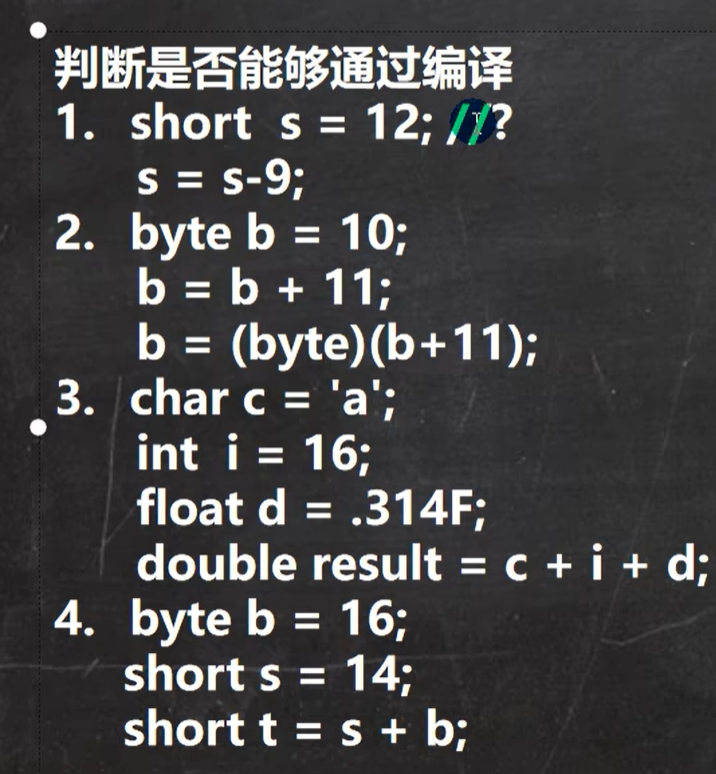

自己答案:

1,编译错误,,s是short类型,s-9变成in类型,导致数据类型长度不足

2,上一条语句编译错误,下面一条语句可以编译

3,可以编译成功

4,编译不能成功,byte参与计算的时候自动转化为int类型,short类型装不了int类型


# 第三章

* 变量介绍

  * 变量相当于现实世界的抽象

  * 在计算机中,变量相当于数据存储空间的表示,变量映射到一个内存中的地址,通过地址记录数据

  * 变量使用的步骤

    * 声明变量 int a

    * 赋值 a =60;

    * 使用System.out.println(a)

    * 变量的声明和赋值可以同时进行


```java
public class VarDetail{	
 	public static void main(String[] args){
 	//声明一个叫做a的变量
 	int a = 50;
 	System.out.println(a);
 	//该区域的数据/值可以在同一个类型范围内不断地变化
 	//a = "jACK"
 	a = 88;
 	System.out.println(a);

 	//变量不能在同一个作用域内重名
 	//int a = 77;
 	}
}

class Dog {
	public static void main(String[] args){
		//不同作用域
		int a = 1000;
		System.out.println(a);
	}
}
```


* +号的使用

  * 当两边都是数值型的时候,则是做加法运算

  * 当左右两边有一方为字符串的时候,则做的是拼接运算

  * 运算的顺序是从左到右

    ```java
    public class Plus{	
     	public static void main(String[] args){
     		System.out.println(100 + 98);
     		System.out.println("100" + 98);
    
    
    		System.out.println(100 + 3 + "hello");
    		System.out.println("hello" + 100 + 3);
     	}
     }
    ```


* 数据类型

  * 每一种数据都定义了明确的数据类型,在内存中分配了不同大小的内存空间(字节)

    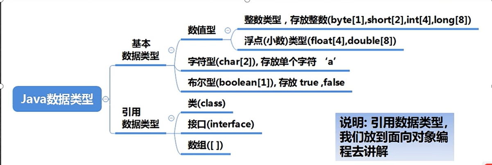

Java中有八大基本类型

1,java数据类型分为了两个大类(基本数据类型,引用数据类型)

2,基本数据类型有8种,数值型[byte,short,int,long,float,double]char,boolean

3,引用类型[类,接口,数组][](String)


P40 整数类型

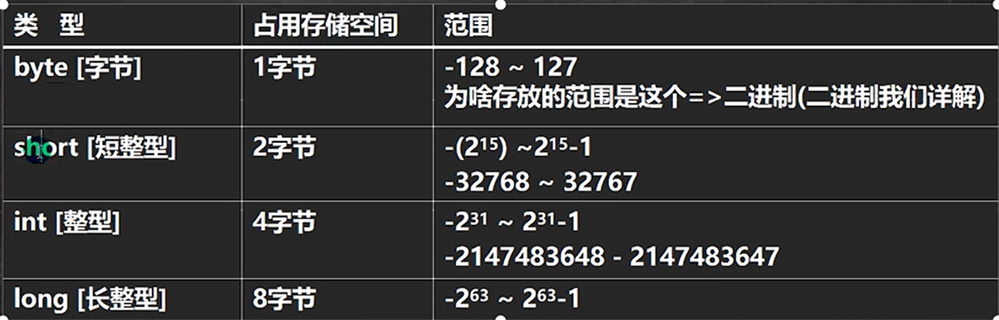

P42整数类型在使用中的细节

1,Java各整数类型有固定的范围和字段长度,不受具体OS[操作系统]的影响,以保证java程序的可移植性

2,Java的整型常量(具体值)默认为int型,声明long型常量须后面加上'l' 或者 'L'

```java
public class IntDetail{	
 	public static void main(String[] args){
 		int a = 8;
 		int b = 8l;
 	}
 }
```

3,java中变量常声明为int,除非不足以表示大数,才使用long(人的年龄使用byte就足够存下)

4,java程序中的最小存储单位,byte:计算机中基本存储单元 1 byte = 8 bit

[二进制在详细说]

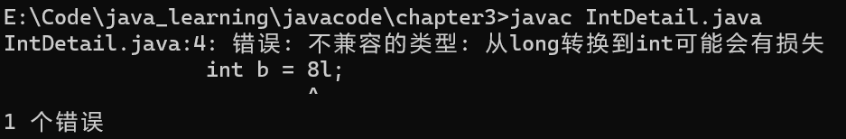


P43浮点类型

浮点类型可以表示一个小数

* 浮点类型的分类

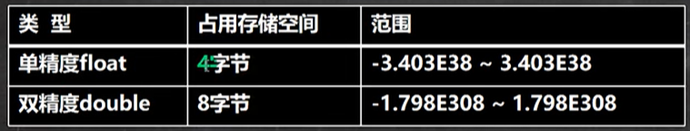

1,关于浮点数在机器中存放形式的简单说明,浮点数 = ==符号位 + 指数位  + 尾数位==

2,尾数部分可能丢失,造成精度损失(小数都是近似值)


* 编码

* 数据类型转换


 


<!---->
